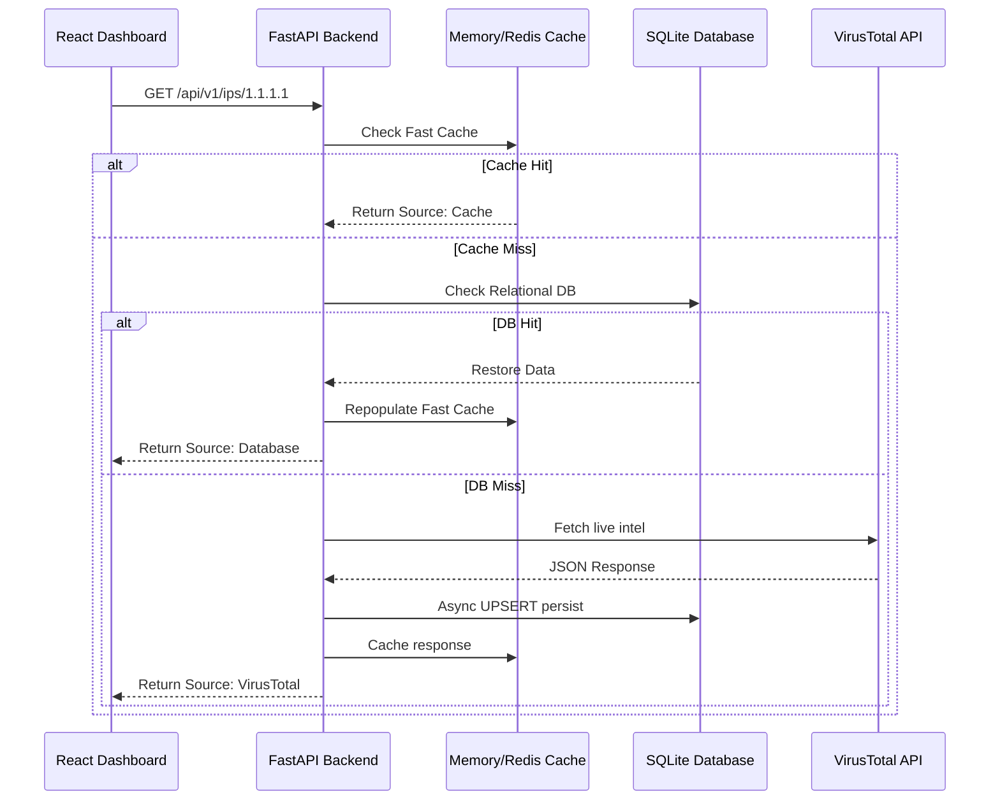

# 🛡️ VirusTotal Data Pipeline


A high-performance, async data pipeline that orchestrates threat intelligence ingestion from the **VirusTotal API v3**. It features robust caching layers, safe API-rate limiting, relational persistence, and exposes a beautiful metrics dashboard built on Vite + React.

---

## ⚡ Features & Capabilities

- **Automated Threat Intelligence**: Smart indicator ingestion tailored for `domains`, `IPs`, and `file hashes`.
- **Advanced Rate Management**: Token-bucket async rate limiter natively enforces VT's strict quota (4 req/min) without randomly dropping user queries.
- **Smart 3-Tier Architecture**:
  1. **L1 Memory/Redis Cache**: Ultra-fast initial responses.
  2. **L2 Database Cache**: SQLAlchemy + SQLite persistence indefinitely holds historic queries to save VT API cycles.
  3. **L3 Upstream Fetch**: Direct API polling over `httpx` logic fallback.
- **Dynamic React Flow GUI**: Modern visualization of threat breakdowns (Malicious, Suspicious, Harmless) featuring pure CSS layouts and glassmorphism styling.

## 🏗️ System Architecture Flow



## 📋 Prerequisites
* **Python 3.9+**
* **Node.js 18+**

## 🚀 Quick Setup Guide

### 1. Initialize the Core Backend
```bash
git clone https://github.com/ShachiMistry/VirusTotal-Data-Pipeline.git
cd VirusTotal-Data-Pipeline

# Spin up environment
python3 -m venv venv
source venv/bin/activate

# Install dependencies
pip install -r requirements.txt
pip install greenlet
```

### 2. Configure Your Environment
Establish the proper pipeline connections by copying the example environment format.
```bash
cp .env.example .env
```
_Edit the newly created `.env` file and enforce the `VT_API_KEY` placeholder with your active VirusTotal Developer Key._

### 3. Start the Services
Run the following in two separate terminal instances to boot both the API router and the graphical dashboard interface.

**Terminal 1 — FastAPI Server:**
```bash
source venv/bin/activate
uvicorn main:app --reload
```
_Your Swagger docs are now alive at `http://127.0.0.1:8000/docs`_

**Terminal 2 — React Dashboard Server:**
```bash
cd frontend
npm install
npm run dev
```
## 🐳 Docker Deployment (Recommended)

The easiest way to run the entire pipeline (Backend, Frontend, and Redis) is using Docker Compose.

```bash
# Ensure you have a .env file with your VT_API_KEY
docker compose up -d --build
```
_The dashboard will be available at `http://localhost:80`_

---

## ☁️ AWS EC2 Deployment

We provide automated scripts to deploy this pipeline to an Amazon Linux 2023 instance.

### 1. Prepare your EC2 Instance
Run the setup script on your server to install Docker and system dependencies:
```bash
# From your local machine, copy and run the setup
scp -i your-key.pem aws/setup_ec2.sh ec2-user@your-instance-ip:~/
ssh -i your-key.pem ec2-user@your-instance-ip "chmod +x setup_ec2.sh && ./setup_ec2.sh"
```

### 2. Deploy the Pipeline
Use the deployment helper to sync your local code. The IP address is optional; if omitted, it defaults to the last configured server.

```bash
# Option A: Use default IP
./aws/deploy_to_ec2.sh your-key.pem

# Option B: Use a new/changed IP (e.g., after a restart)
./aws/deploy_to_ec2.sh your-key.pem 54.x.x.x
```

> [!TIP]
> **Avoid IP Changes**: To keep your IP stable forever, allocate an **Elastic IP** in the AWS Console and attach it to your instance. This ensures you never have to change your deployment command or dashboard URL!

---

## 🔌 Core API Routes

All endpoints natively resolve the optimal caching sequence before invoking the external VT Network APIs. 

| Method | Component URI | Operation Details |
| :--- | :--- | :--- |
| `GET` | `/api/v1/domains/{domain}` | Extract safety metrics for tracked URLs. |
| `GET` | `/api/v1/ips/{ip}` | Aggregate global ASN nodes and malware routing. |
| `GET` | `/api/v1/files/{hash}` | Parse SHA-256 analysis records and classifications. |
| `GET` | `/api/health` | Diagnostic polling block for monitoring. |

_Note: You can pass the `?refresh=true` logical argument on any pipeline endpoint to actively bypass the Cache & Database mechanisms and force a raw upstream request!_

---

## 📜 License
This project is licensed under the MIT License - see the [LICENSE](LICENSE) file for details.
